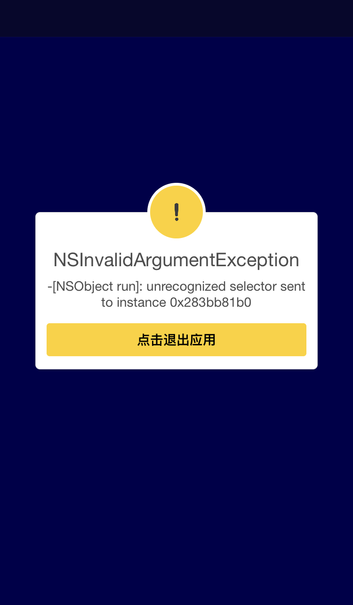
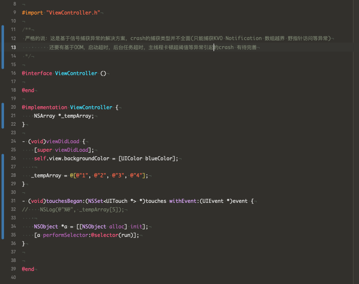

# Exception4iOS

* Update in #YearOf2023. 
  AI is coming now, he reads all minds between you and me, and he acts as a human. I've been using OpenAI since it was released. It's pretty cool for dealing with tasks, and I think a lot of programmers will lose their jobs, but ENGINEERS WILL NOT. iOS is not hot any more, this repo seems to be my last Objective-C repo in past years, I wrote Swift recently years, and I keep focusing on fields among CPU, Network, IO, Threads and System-Call in kernel for a better understanding as a Pro Engineer. I believe that you will do the same stuffs.

* Stop maintaining the repo any more. 
  + API Swizzle for API-hooking and dealing with exceptions in Runtime and RunLoop.
  + Add a watchdog for keeping eyes open on unix fatal signals in kernel. (Try `man signal` in terminal you'll find out)
  + Monitor count of wakeups while context exchanged or be soft-interrupted on iOS.
  + Monitor count of threads for avoiding segment fatal error and thread-explosion.

  Using the solutions above to prevent iOS App crashing and keep it strong as a gaint in last 5 years on release environment. Email me if you want to know the details and I'm glad to share with.

      

* Handle with exceptions on iOS based on signals and RunLoop.  
  When App is about to crash, it recieved the signals sent from iOS-System, and current RunLoop on the thread will exit immediately(CRASH!). What we can make a better way to exit, is to setting-up a new parallel level RunLoop and fetch all modes, input-sources, timers...etc from the previous RunLoop which will be terminated, and then we put all those stuffs into our new parallel level RunLoop for holding a second for user interface. That will make sence that the App is not crashing for normal users.   
    
    
  <b>Best practices: You can upload the detail crash info to server once the exception caught or the next launching the App(Cool-Launching). At the parallel solution for handing exception, we should pay more attention both on logging event and collecting statistics.</b>  
  
  

* Handle with crashes those cannot be caught by signals.  
  + Out of Memory  
  + Launching OverTime  
  + Background Task Timeout  
  + MainThread Task OverFitting Threshold (watchdog)

